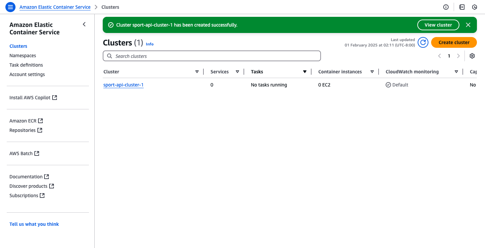
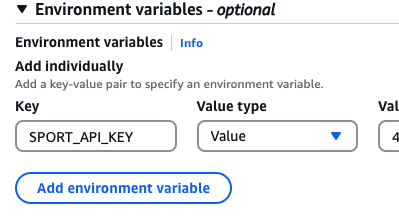
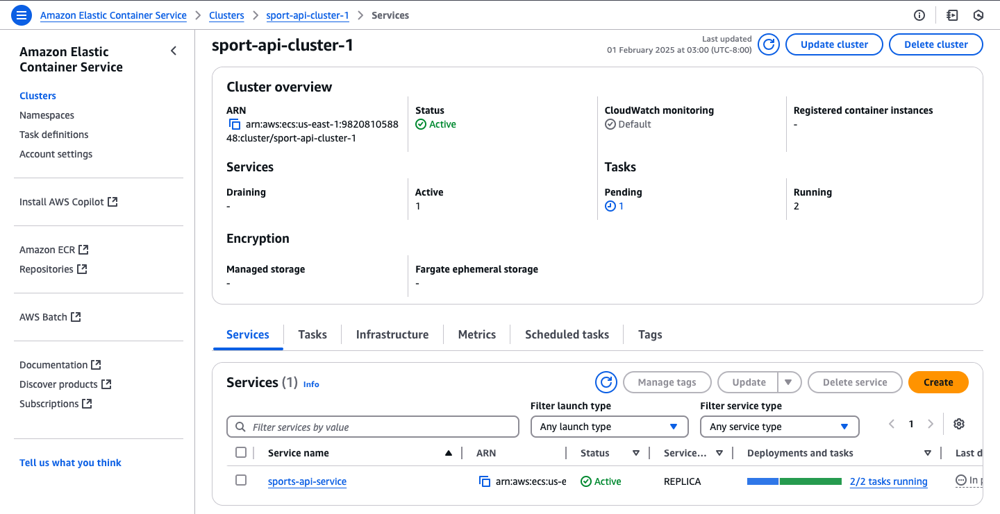
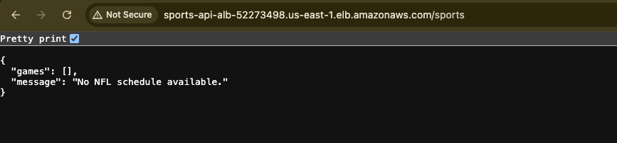
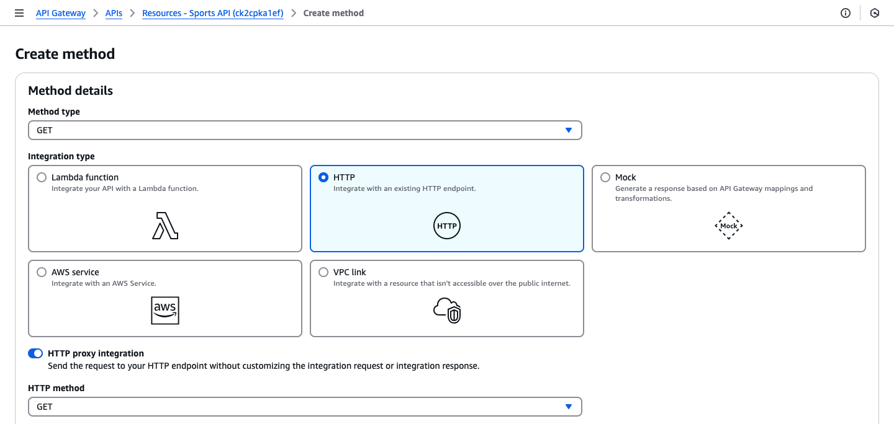
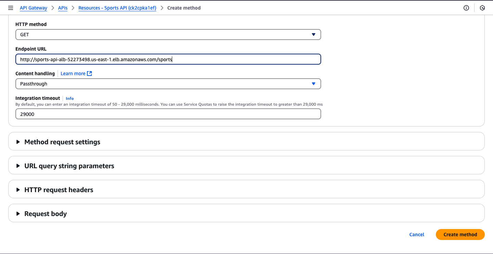
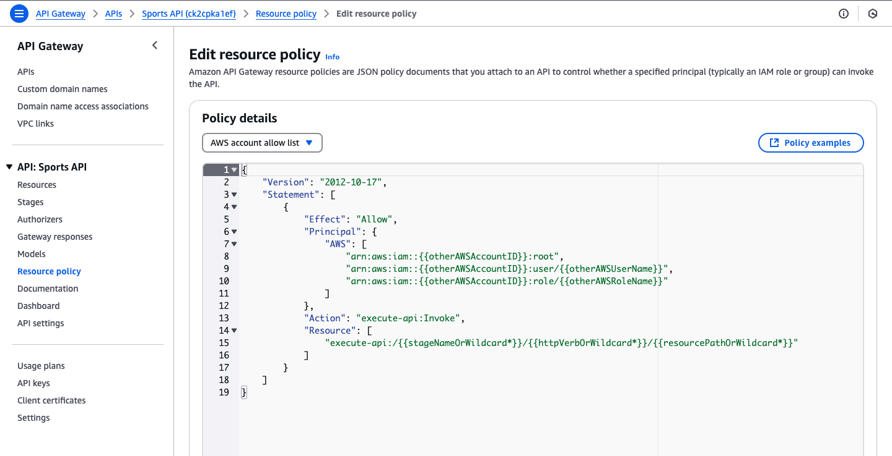
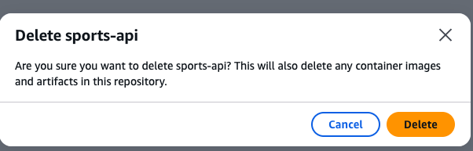
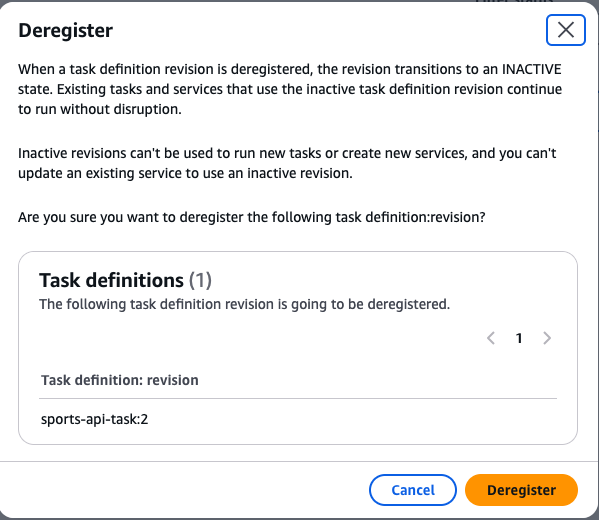

# Sports API Management System

## **Project Overview**
This project demonstrates building a containerized API management system for querying sports data. It leverages **Amazon ECS (Fargate)** for running containers, **Amazon API Gateway** for exposing REST endpoints, and an external **Sports API** for real-time sports data. The project showcases advanced cloud computing practices, including API management, container orchestration, and secure AWS integrations.

---

## **Features**
- Exposes a REST API for querying real-time sports data
- Runs a containerized backend using Amazon ECS with Fargate
- Scalable and serverless architecture
- API management and routing using Amazon API Gateway
 
---

## **Prerequisites**
- **Sports API Key**: Sign up for a free account and subscription & obtain your API Key at serpapi.com
- **AWS Account**: Create an AWS Account & have basic understanding of ECS, API Gateway, Docker & Python
- **AWS CLI Installed and Configured**: Install & configure AWS CLI to programatically interact with AWS
- **Serpapi Library**: Install Serpapi library in local environment "pip install google-search-results"
- **Docker CLI and Desktop Installed**: To build & push container images

---

## **Technical Architecture**


---

## **Technologies**
- **Cloud Provider**: AWS
- **Core Services**: Amazon ECS (Fargate), API Gateway, CloudWatch
- **Programming Language**: Python 3.x
- **Containerization**: Docker
- **IAM Security**: Custom least privilege policies for ECS task execution and API Gateway

---

## **Project Structure**

```bash
sports-api-management/
├── app.py # Flask application for querying sports data
├── Dockerfile # Dockerfile to containerize the Flask app
├── requirements.txt # Python dependencies
├── .gitignore
└── README.md # Project documentation
```

---

## **Setup Instructions**

### **Clone the Repository**
```bash
git clone https://github.com/Stormz99/CONTAINERIZED_SPORT_API_FOR_NFL_GAMES.git
cd containerized-sports-api
```
### **Create ECR Repo**
```bash
aws ecr create-repository --repository-name sports-api --region us-east-1
```

### **Authenticate Build and Push the Docker Image**
```bash
aws ecr get-login-password --region us-east-1 | docker login --username AWS --password-stdin <AWS_ACCOUNT_ID>.dkr.ecr.us-east-1.amazonaws.com

docker build --platform linux/amd64 -t sports-api .
docker tag sports-api:latest <AWS_ACCOUNT_ID>.dkr.ecr.us-east-l1.amazonaws.com/sports-api:sports-api-latest
docker push <AWS_ACCOUNT_ID>.dkr.ecr.us-east-1.amazonaws.com/sports-api:sports-api-latest
```


### **Set Up ECS Cluster with Fargate**
1. Create an ECS Cluster:
- Go to the ECS Console → Clusters → Create Cluster
- Name your Cluster (sports-api-cluster)
- For Infrastructure, select Fargate, then create Cluster



2. Create a Task Definition:
- Go to Task Definitions → Create New Task Definition
- Name your task definition (sports-api-task)
- For Infrastructure, select Fargate
- Add the container:
  - Name your container (sports-api-container)
  - Image URI: <AWS_ACCOUNT_ID>.dkr.ecr.us-east-1.amazonaws.com/sports-api:sports-api-latest
  - Container Port: 8080
  - Protocol: TCP
  - Port Name: Leave Blank
  - App Protocol: HTTP
- Define Environment Eariables:
  - Key: SPORTS_API_KEY
  - Value: <YOUR_SPORTSDATA.IO_API_KEY>
  - Create task definition





3. Run the Service with an ALB
- Go to Clusters → Select Cluster → Service → Create.
- Capacity provider: Fargate
- Select Deployment configuration family (sports-api-task)
- Name your service (sports-api-service)
- Desired tasks: 2
- Networking: Create new security group
- Networking Configuration:
  - Type: All TCP
  - Source: Anywhere
- Load Balancing: Select Application Load Balancer (ALB).
- ALB Configuration:
 - Create a new ALB:
 - Name: sports-api-alb
 - Target Group health check path: "/sports"
 - Create service

 




4. Test the ALB:
- After deploying the ECS service, note the DNS name of the ALB (e.g., sports-api-alb-<AWS_ACCOUNT_ID>.us-east-1.elb.amazonaws.com)
- Confirm the API is accessible by visiting the ALB DNS name in your browser and adding /sports at end (e.g, http://sports-api-alb-<AWS_ACCOUNT_ID>.us-east-1.elb.amazonaws.com/sports)




### **Configure API Gateway**
1. Create a New REST API:
- Go to API Gateway Console → Create API → REST API
- Name the API (e.g., Sports API Gateway)


2. Set Up Integration:
- Create a resource /sports
- Create a GET method
- Choose HTTP Proxy as the integration type
- Create an Invoke Policy
- Enter the DNS name of the ALB that includes "/sports" (e.g. http://sports-api-alb-<AWS_ACCOUNT_ID>.us-east-1.elb.amazonaws.com/sports







3. Deploy the API:
- Deploy the API to a stage (e.g., prod)
- Note the endpoint URL


### **Test the System**
- Use curl or a browser to test:
```bash
curl https://<api-gateway-id>.execute-api.us-east-1.amazonaws.com/prod/sports
```


### ***Deleting the Resources***
After the API Gateway is successfully working, all provisioned resources, should be deleted. This is to prevent incurring bills.







### **What I Learned**
Setting up a scalable, containerized application with ECS
Creating public APIs using API Gateway.


